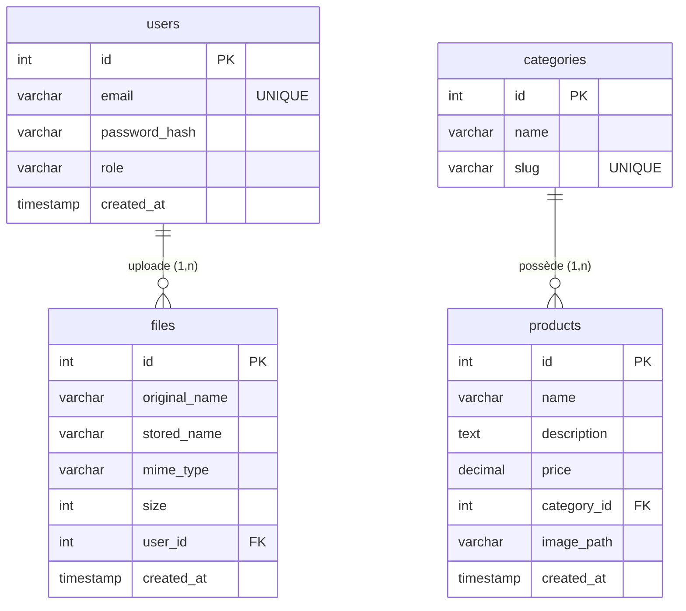

# Cahier des Charges - Projet PHP MVC

## 1. Présentation du sujet et analyse des besoins

### Présentation du sujet
Le projet consiste en la conception et le développement d'une application web de gestion (back-office) basée sur une architecture **MVC (Modèle-Vue-Contrôleur)** construite "from scratch" en PHP natif. Ce choix technologique permet de maîtriser intégralement le cycle de vie de la requête HTTP sans dépendre de frameworks externes, garantissant ainsi une application légère, performante et hautement sécurisée.

L'application a pour objectif de fournir une interface d'administration complète permettant de gérer des produits, leurs catégories, les utilisateurs du système ainsi qu'un espace de stockage de fichiers (File Manager).

### Analyse des besoins
**Besoins Fonctionnels :**
- **Authentification et Autorisation :** Un système de connexion sécurisé avec gestion des rôles (ex: administrateur). L'accès aux modules (dashboard, gestion) doit être restreint aux utilisateurs authentifiés.
- **Gestion des Produits et Catégories (CRUD) :** L'utilisateur doit pouvoir créer, lire, modifier et supprimer des produits et des catégories. Un produit doit appartenir à une catégorie.
- **Recherche Avancée :** Un moteur de recherche dynamique multi-critères avec système de pagination pour filtrer le catalogue de produits.
- **Gestionnaire de Fichiers (File Manager) :** Un module permettant l'upload sécurisé de fichiers, leur validation (MIME types, taille), leur stockage physique isolé, et le référencement de leurs métadonnées en base de données.

**Besoins Non Fonctionnels :**
- **Design et Ergonomie (UI/UX) :** Interface utilisateur moderne et "premium", utilisant les principes du *glassmorphism*, avec un mode sombre (dark mode), des transitions fluides et un design entièrement responsive.
- **Sécurité :** Protection contre les failles courantes (injections SQL via requêtes préparées PDO, failles XSS via l'échappement des sorties, protection des mots de passe via `password_hash`).
- **Architecture :** Respect strict du patron de conception MVC, séparation des logiques (Routeur, Contrôleurs, DAO, Entités, Vues).

---

## 2. Schéma relationnel de la base de données

L'architecture des données repose sur 4 entités principales interconnectées.

**Règles de gestion :**
- Un **produit** appartient à zéro ou une **catégorie** (clé étrangère `category_id` avec clause `ON DELETE SET NULL`).
- Un **fichier** uploadé est obligatoirement lié à l'**utilisateur** qui l'a soumis (clé étrangère `user_id` avec clause `ON DELETE CASCADE`).

---

## 3. Captures d'écran légendées (Guide utilisateur)

Ce guide décrit visuellement le fonctionnement des modules principaux de l'application.

### A. Interface d'Authentification
*(Insérer la capture d'écran de `http://localhost/PHP-Project/public/` ici)*  
**Légende :** *Page de connexion au back-office.* 
L'utilisateur doit entrer ses identifiants (ex: admin@example.com). Le formulaire est stylisé avec des effets de transparence et un arrière-plan dynamique. En cas d'erreur de frappe, un message d'alerte rouge s'affiche.

### B. Tableau de bord (Dashboard)
*(Insérer la capture d'écran du Dashboard ici)*  
**Légende :** *Le tableau de bord principal après connexion.*
Une fois authentifié, l'administrateur accède au panel d'accueil qui sert de point de navigation vers les différents modules (Gestion des produits, Fichiers, Recherche).

### C. Gestion des Produits (Index & Formulaire)
*(Insérer la capture d'écran de la liste des produits ici)*  
**Légende :** *Affichage sous forme de grille/tableau des produits existants.*
Cette vue affiche tous les produits avec leurs catégories associées. Des boutons d'action (Ajouter, Éditer, Supprimer) permettent d'interagir avec les données.

*(Insérer la capture d'écran du formulaire de création/édition ici)*  
**Légende :** *Formulaire d'ajout d'un nouveau produit.*
Les champs obligatoires sont marqués. Le design inclut des sélecteurs (dropdowns) pour la catégorie et un champ d'upload pour l'image du produit.

### D. Recherche Avancée
*(Insérer la capture d'écran du module de recherche ici)*  
**Légende :** *Moteur de recherche multicritères.*
L'utilisateur peut saisir des mots-clés. La liste des résultats se met à jour et inclut un système de pagination ergonomique au bas de la page.

### E. Gestionnaire de Fichiers (Upload)
*(Insérer la capture d'écran du File Manager ici)*  
**Légende :** *Interface d'upload et historique des fichiers.*
Espace dédié à la gestion des médias. Affiche la taille, le format (MIME type), le nom du propriétaire, et la date d'upload. Permet de télécharger en un clic de nouvelles pièces jointes de manière sécurisée.
